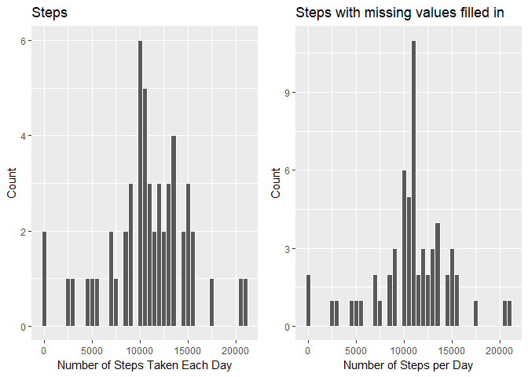

### Loading the data:


```r
act_data <- read.csv("./Data/activity.csv")
```
Here's a summary of the data:

```r
summary(act_data)
```

```
##      steps                date          interval     
##  Min.   :  0.00   2012-10-01:  288   Min.   :   0.0  
##  1st Qu.:  0.00   2012-10-02:  288   1st Qu.: 588.8  
##  Median :  0.00   2012-10-03:  288   Median :1177.5  
##  Mean   : 37.38   2012-10-04:  288   Mean   :1177.5  
##  3rd Qu.: 12.00   2012-10-05:  288   3rd Qu.:1766.2  
##  Max.   :806.00   2012-10-06:  288   Max.   :2355.0  
##  NA's   :2304     (Other)   :15840
```

### What is mean total number of steps taken per day?
For this part of the assignment, you can ignore the missing values in the dataset.

 1. Calculate the total number of steps taken per day

```r
library(ggplot2)
totalSteps <- aggregate(act_data$steps, by = list(Date = act_data$date), FUN = sum)
names(totalSteps)[names(totalSteps) == "x"] <- "Total"
temp <- as.Date(totalSteps$Date, "%Y-%m-%d")
totalSteps$Date <- format(temp, format = "%m-%d")
head(totalSteps)
```

```
##    Date Total
## 1 10-01    NA
## 2 10-02   126
## 3 10-03 11352
## 4 10-04 12116
## 5 10-05 13294
## 6 10-06 15420
```

 2. Make a histogram of the total number of steps taken each day

```r
hist1 <- ggplot(data = na.omit(totalSteps), aes(Total))+
        geom_histogram(binwidth = 500, color = "white")+
        xlab("Number of Steps Taken Each Day")+
        ylab("Count")+
        ggtitle("Steps")
print(hist1)
```

<!-- -->

 3. Calculate and report the mean and median of the total number of steps taken per day
 
        This is the mean:
        
 
 ```r
 mean(na.omit(totalSteps$Total))
 ```
 
 ```
 ## [1] 10766.19
 ```
 
        This is the median:
        

```r
median(na.omit(totalSteps$Total))
```

```
## [1] 10765
```

### What is the average daily activity pattern?

 1. Make a time series plot of the 5-minute interval(x-axis) and the average
 number of steps taken, averaged across all days (y-axis)
 

```r
fiveMinSteps <- aggregate(steps~interval, data = act_data, FUN = mean)
TS1 <- ggplot(data = fiveMinSteps, aes(x = interval, y = steps))+
        geom_line()+
        xlab("5-Minute Time Intervals")+
        ylab("Average Number of Steps")+
        ggtitle("Average Number of Steps on 5-minute Time Intervals")
print(TS1)
```

<!-- -->

 2. Which 5-minute interval, on average across all the days in the dataset, 
 contains the maximum number of steps?
 

```r
fiveMinSteps[which(fiveMinSteps$steps == max(fiveMinSteps$steps)),]
```

```
##     interval    steps
## 104      835 206.1698
```

### Inputtig missing values

 1. Calculate and report the total number of missing values in the dataset (i.e., 
 the total number of rows with NAs)
 

```r
sapply(X = act_data, FUN = function(x) sum(is.na(x)))
```

```
##    steps     date interval 
##     2304        0        0
```

 2. Devise a strategy for filling in all of the missing values in the dataset. The strategy doesn't need to be sophisticated. For example, you could use the mean/median for that day, or the mean for that 5-minute interval, etc.


```r
library(dplyr)
```

```
## 
## Attaching package: 'dplyr'
```

```
## The following objects are masked from 'package:stats':
## 
##     filter, lag
```

```
## The following objects are masked from 'package:base':
## 
##     intersect, setdiff, setequal, union
```

```r
fillMissingVals <- function(num) replace(num, is.na(num), mean(num, na.rm = TRUE))
meanofDay <- (act_data %>% group_by(interval) %>% mutate(steps = fillMissingVals(steps)))
head(meanofDay)
```

```
## # A tibble: 6 x 3
## # Groups: interval [6]
##    steps date       interval
##    <dbl> <fctr>        <int>
## 1 1.72   2012-10-01        0
## 2 0.340  2012-10-01        5
## 3 0.132  2012-10-01       10
## 4 0.151  2012-10-01       15
## 5 0.0755 2012-10-01       20
## 6 2.09   2012-10-01       25
```

```r
sum(is.na(meanofDay))
```

```
## [1] 0
```

 3. Create a new dataset that is equal to the original dataset but with the missing data filled in.
 

```r
newDataset <- as.data.frame(meanofDay)
head(newDataset)
```

```
##       steps       date interval
## 1 1.7169811 2012-10-01        0
## 2 0.3396226 2012-10-01        5
## 3 0.1320755 2012-10-01       10
## 4 0.1509434 2012-10-01       15
## 5 0.0754717 2012-10-01       20
## 6 2.0943396 2012-10-01       25
```

```r
summary(newDataset)
```

```
##      steps                date          interval     
##  Min.   :  0.00   2012-10-01:  288   Min.   :   0.0  
##  1st Qu.:  0.00   2012-10-02:  288   1st Qu.: 588.8  
##  Median :  0.00   2012-10-03:  288   Median :1177.5  
##  Mean   : 37.38   2012-10-04:  288   Mean   :1177.5  
##  3rd Qu.: 27.00   2012-10-05:  288   3rd Qu.:1766.2  
##  Max.   :806.00   2012-10-06:  288   Max.   :2355.0  
##                   (Other)   :15840
```

 4. Make a histogram of the total number of steps taken each day and calculate and report the mean and the median total number of steps taken per day. Do these values differfrom the first part of the assignment? What is the impact of imputting missing data on the estimates of the total daily number of steps?
 

```r
newSteps <- aggregate(newDataset$steps, by = list(newDataset$date), FUN = sum)
names(newSteps)[names(newSteps) == "x"] <- "Total"
names(newSteps)[names(newSteps) == "Group.1"] <- "Date"
hist2 <- ggplot(data = newSteps, aes(Total))+
        geom_histogram(binwidth = 500, color = "white")+
        xlab("Number of Steps per Day")+
        ylab("Count")+
        ggtitle("Steps with missing values filled in")
print(hist2)
```

<!-- -->
Comparing the two plots:


```r
library(grid)
library(gridExtra)
```

```
## 
## Attaching package: 'gridExtra'
```

```
## The following object is masked from 'package:dplyr':
## 
##     combine
```

```r
grid.arrange(hist1, hist2, ncol = 2)
```

<!-- -->

Calculating means:

```r
mean(na.omit(totalSteps$Total))
```

```
## [1] 10766.19
```

```r
mean(newSteps$Total)
```

```
## [1] 10766.19
```

Calculating medians:

```r
median(na.omit(totalSteps$Total))
```

```
## [1] 10765
```

```r
median(newSteps$Total)
```

```
## [1] 10766.19
```
Looking at the histograms we can see that they are slighty different. Also, while the means are the same, the medians are different as well.

### Are there differences in activity pattern between weekdays and weekends?

 1. Create a new factor variable in the dataset with two levels - "weekday" and "weekend" indicating whether a given date is a weekday or a weekend day.
 

```r
newDataset$WeekendOrWeekday <- ifelse(weekdays(as.Date(newDataset$date)) %in% c("Monday", "Tuesday", "Wednesday", "Thursday", "Friday"), "Weekday", "Weekend")
head(newDataset)
```

```
##       steps       date interval WeekendOrWeekday
## 1 1.7169811 2012-10-01        0          Weekday
## 2 0.3396226 2012-10-01        5          Weekday
## 3 0.1320755 2012-10-01       10          Weekday
## 4 0.1509434 2012-10-01       15          Weekday
## 5 0.0754717 2012-10-01       20          Weekday
## 6 2.0943396 2012-10-01       25          Weekday
```

 2. Make a panel plot containing a time series plot of the 5-minute interval (x-axis) and the average number of steps taken, averaged across all weekdays or weekend days (y-axis). 
 

```r
newDataset <- (newDataset %>% group_by(interval, WeekendOrWeekday) %>% summarise(Mean = mean(steps)))
ggplot(newDataset, mapping = aes(x = interval, y = Mean)) + geom_line() +
    facet_grid(WeekendOrWeekday ~.) + xlab("Interval") + ylab("Mean of Steps") +
    ggtitle("Comparison of Average Number of Steps: Weekend & Weekday")
```

<!-- -->

By comparing the plots we can see that, though they are similar, they are not identical. Therefore there are some differences in actvity patterns between weekdays and weekends.

 
 
 
 
 
 
 
